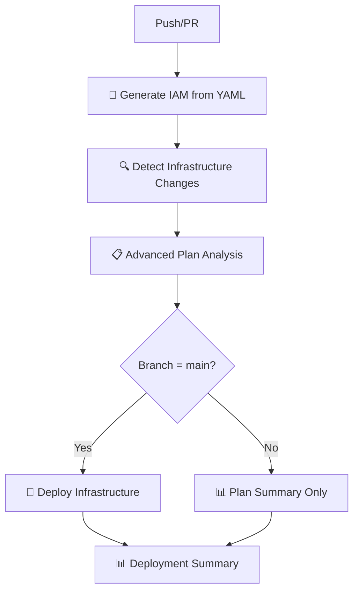

# 🚀 GitHub Actions Workflows

## ✅ **WORKFLOW CONSOLIDADO - PROBLEMA RESUELTO**

Después de identificar la duplicación de recursos IAM entre workflows, se ha **consolidado todo en un solo workflow unificado**:

## 📋 Workflow Único: `sgsi-deployment.yaml`

### 🎯 **Capacidades Completas:**
- ✅ **Generación IAM:** Crea módulos Terraform desde definiciones YAML
- ✅ **Validación:** Valida todas las definiciones YAML
- ✅ **Análisis Visual:** Plan analysis con tablas detalladas y contadores
- ✅ **5 Capas SGSI:** Despliega infraestructura completa secuencialmente
- ✅ **Multi-ambiente:** Soporte para dev/staging/production
- ✅ **Detección de cambios:** Solo despliega capas modificadas
- ✅ **Reportes avanzados:** GitHub Step Summary con visualización completa

### 🔧 **Flujo Unificado:**



### 🎨 **Capacidades Visuales:**

#### Plan Analysis
- 📊 **Contadores por acción:** Creates, Updates, Destroys
- 📋 **Tablas detalladas:** Recursos y acciones con iconos
- 🎯 **Categorización:** Por tipo de cambio (IAM, Network, etc.)
- 📈 **Métricas:** Estadísticas de archivos generados

#### Change Detection
- 🔍 **Matrix de capas:** Estado de cada capa SGSI
- ✅ **Indicadores visuales:** Iconos para cambios detectados
- 📱 **Responsive tables:** Compatibles con GitHub mobile

#### Deployment Summary
- 📊 **Estado final:** Resultado de cada job
- 🎯 **Decisiones:** Qué se desplegó y por qué
- ⏱️ **Timestamps:** Cuándo y desde qué commit

### **Triggers:**
- **Push a `main`, `dev`:** Ejecuta generación + plan + deploy (solo main)
- **Pull requests a `main`:** Ejecuta generación + plan (sin deploy)
- **Manual dispatch:** Control completo con opciones de ambiente

### **Ambientes:**
- **DEV:** Generación + Plan + Deploy automático
- **MAIN:** Generación + Plan + Deploy con environment protection
- **PR:** Solo generación + plan (sin deploy)

## 🔄 **Separación de Responsabilidades SOLUCIONADA**

### ❌ **Problema Anterior:**
```
- generate-iam.yml: Creaba github-actions-iam-deployment-role
- sgsi-deployment.yaml: También creaba github-actions-iam-deployment-role
= CONFLICTO: Mismo recurso en 2 workflows
```

### ✅ **Solución Actual:**
```
- sgsi-deployment.yaml (unificado):
  1. Genera políticas IAM desde YAML
  2. Detecta cambios en infraestructura  
  3. Planifica todos los recursos sin conflictos
  4. Despliega secuencialmente en orden correcto
= Sin duplicación: Un solo workflow con scope completo
```

## 🎯 **Workflow Decision Matrix**

| Evento | Rama | Qué ejecuta | Resultado |
|--------|------|-------------|-----------|
| Push | `dev` | Generación + Plan + Deploy | Deploy automático en DEV |
| Push | `main` | Generación + Plan + Deploy | Deploy con protection en PROD |
| PR | `main` | Generación + Plan | Solo validación |
| Manual | Cualquiera | Todo con opciones | Deploy controlado |

## 🚨 **Beneficios del Workflow Unificado**

1. **Sin duplicación:** Eliminado conflicto de recursos IAM
2. **Capacidad visual completa:** Toda la funcionalidad del workflow original
3. **Menos complejidad:** Un solo workflow vs dos workflows conflictivos  
4. **Mejor debugging:** Un solo lugar para troubleshooting
5. **Consistent state:** Sin race conditions entre workflows
6. **Ambiente único:** No más confusion sobre qué workflow usar

## 📚 **Documentación Relacionada**

- [`docs/DEPLOYMENT.md`](../docs/DEPLOYMENT.md) - Procedimientos de deployment
- [`layers/README.md`](../layers/README.md) - Documentación de capas SGSI
- [`modules/README.md`](../modules/README.md) - Módulos enterprise

---

**✅ Status:** Workflow consolidado y funcionando sin duplicaciones

## 🔧 Configuración Requerida

### Secrets de GitHub
```
AWS_ROLE_ARN=arn:aws:iam::051963532279:role/github-deployment-role
PAT_TOKEN=<personal-access-token> (opcional)
```

### Variables de Ambiente
```
AWS_REGION=us-east-1
TF_VERSION=1.7.4
```

## 🛡️ Seguridad

### Permisos OIDC
Los workflows usan OpenID Connect (OIDC) para autenticación con AWS:
- No requiere claves de acceso estáticas
- Roles IAM específicos por workflow
- Sesiones temporales con scope limitado

### Restricciones de Rama
- **Producción:** Solo `main` puede hacer deploy
- **Testing:** PRs pueden ejecutar `plan` únicamente
- **Manual:** Dispatch permite selección de ambiente

## 📊 Monitoreo

### Artefactos Generados
- `terraform-config-{environment}`: Configuración Terraform generada
- Logs de ejecución por cada capa
- Reportes de deployment en GitHub Summary

### Notificaciones
- Resultados de deployment en GitHub Summary
- Fallos enviados a GitHub Issues (si configurado)
- Integración con Slack/Teams (si configurado)

## 🔄 Flujo de Trabajo Típico

### Desarrollo
1. Crear rama feature: `git checkout -b feature/nueva-funcionalidad`
2. Modificar definiciones YAML o código Terraform
3. Crear PR: Los workflows ejecutan validación y plan
4. Review y merge a `main`

### Producción
1. Merge a `main` dispara deployment automático
2. Workflows detectan cambios en capas específicas
3. Deployment secuencial automático
4. Verificación de resultados

### Emergency Deploy
1. Usar workflow_dispatch manualmente
2. Seleccionar ambiente y capas específicas
3. Forzar deployment si necesario

## 📚 Documentación Relacionada

- [`docs/DEPLOYMENT.md`](../docs/DEPLOYMENT.md) - Procedimientos de deployment
- [`docs/MODULAR-ARCHITECTURE.md`](../docs/MODULAR-ARCHITECTURE.md) - Arquitectura modular
- [`layers/README.md`](../layers/README.md) - Documentación de capas
- [`modules/README.md`](../modules/README.md) - Documentación de módulos

## 🚀 Optimizaciones Recientes

### ✅ Limpieza de Workflows (Oct 2025)
- Eliminado workflow duplicado `sgsi-infrastructure.yml`
- Optimizado triggers para evitar ejecuciones innecesarias
- Mejorada documentación y comentarios

### ✅ Arquitectura Modular
- Integración con nuevos módulos empresariales
- Soporte para deployment basado en cambios
- Workflows específicos por capa de infraestructura

## 🛠️ Troubleshooting

### Errores Comunes
1. **Role ARN inválido:** Verificar configuración de OIDC
2. **Terraform state lock:** Workflows usan concurrency groups
3. **Plan failures:** Revisar dependencias entre capas

### Debug
- Habilitar `ACTIONS_RUNNER_DEBUG=true` para logs detallados
- Revisar artefactos descargables con configuración Terraform
- Usar workflow_dispatch para testing manual