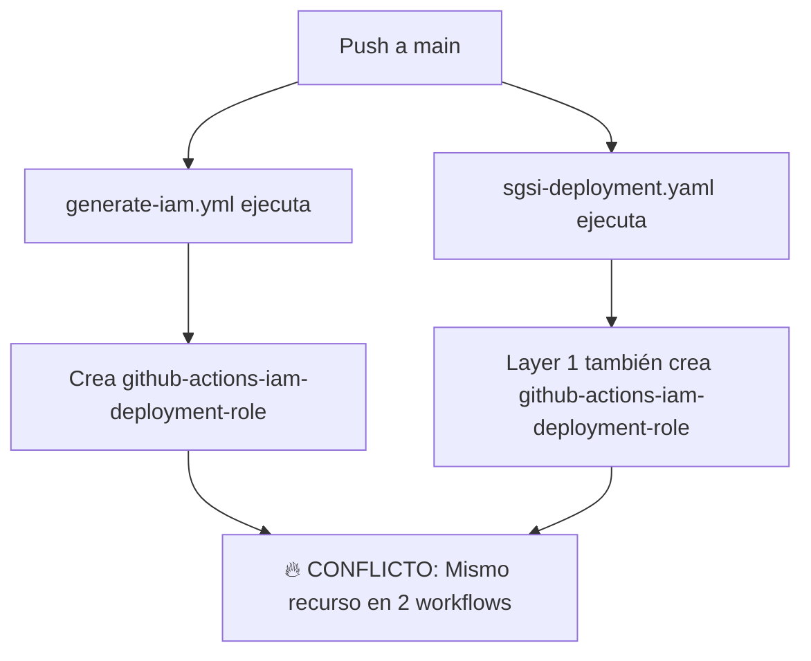
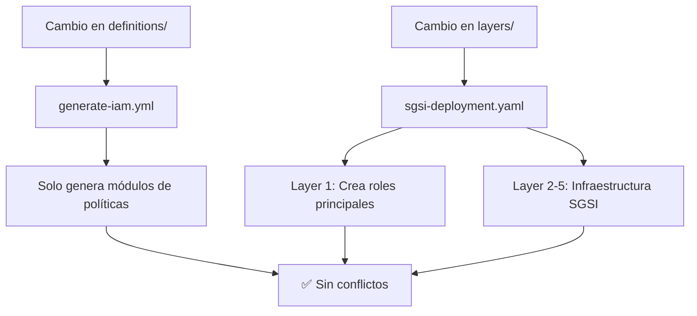

# 🚀 GitHub Actions Workflows

Este repositorio tiene **2 workflows principales** con responsabilidades **claramente separadas**:

## 📋 Workflows Overview

### 1. 🤖 `generate-iam.yml` - IAM Policies Generator
**Scope:** Solo políticas IAM generadas desde YAML
- ✅ **Genera** módulos Terraform desde definiciones YAML
- ✅ **Aplica políticas IAM** en entorno DEV para testing
- ✅ **Valida y formatea** código Terraform generado
- ❌ **NO crea roles IAM** (eso lo hace sgsi-deployment.yaml)

**Triggers:**
- Push a `main`, `dev`, `qa` cuando cambian:
  - `definitions/**`
  - `generators/**` 
  - `templates/**`
- Pull requests a `main`, `qa`
- Manual dispatch

### 2. 🚀 `sgsi-deployment.yaml` - SGSI Infrastructure
**Scope:** Infraestructura completa SGSI en 5 capas
- ✅ **Layer 1 (Foundation):** Roles IAM principales y state backend
- ✅ **Layer 2 (Network):** VPC, subnets, security groups
- ✅ **Layer 3 (Compute):** ALB, ASG, RDS, Lambda
- ✅ **Layer 4 (Storage):** S3, EFS, Backup
- ✅ **Layer 5 (Observability):** CloudTrail, GuardDuty, Security Hub

**Triggers:**
- Push a `main` cuando cambian:
  - `layers/**`
  - `modules/**`
  - `definitions/**`
- Pull requests a `main`
- Manual dispatch con selección de ambiente

## 🔄 Separación de Responsabilidades Actual

### ❌ **Problema Identificado (Duplicación)**
**ANTES:** Ambos workflows creaban el mismo recurso IAM `github-actions-iam-deployment-role`:



### ✅ **Solución Implementada**
**AHORA:** Responsabilidades claramente separadas:



## 🔧 Configuración Requerida

### Secrets de GitHub
```
AWS_ROLE_ARN=arn:aws:iam::051963532279:role/github-deployment-role
PAT_TOKEN=<personal-access-token> (opcional)
```

### Variables de Ambiente
```
AWS_REGION=us-east-1
TF_VERSION=1.7.4
```

## 🛡️ Seguridad

### Permisos OIDC
Los workflows usan OpenID Connect (OIDC) para autenticación con AWS:
- No requiere claves de acceso estáticas
- Roles IAM específicos por workflow
- Sesiones temporales con scope limitado

### Restricciones de Rama
- **Producción:** Solo `main` puede hacer deploy
- **Testing:** PRs pueden ejecutar `plan` únicamente
- **Manual:** Dispatch permite selección de ambiente

## 📊 Monitoreo

### Artefactos Generados
- `terraform-config-{environment}`: Configuración Terraform generada
- Logs de ejecución por cada capa
- Reportes de deployment en GitHub Summary

### Notificaciones
- Resultados de deployment en GitHub Summary
- Fallos enviados a GitHub Issues (si configurado)
- Integración con Slack/Teams (si configurado)

## 🔄 Flujo de Trabajo Típico

### Desarrollo
1. Crear rama feature: `git checkout -b feature/nueva-funcionalidad`
2. Modificar definiciones YAML o código Terraform
3. Crear PR: Los workflows ejecutan validación y plan
4. Review y merge a `main`

### Producción
1. Merge a `main` dispara deployment automático
2. Workflows detectan cambios en capas específicas
3. Deployment secuencial automático
4. Verificación de resultados

### Emergency Deploy
1. Usar workflow_dispatch manualmente
2. Seleccionar ambiente y capas específicas
3. Forzar deployment si necesario

## 📚 Documentación Relacionada

- [`docs/DEPLOYMENT.md`](../docs/DEPLOYMENT.md) - Procedimientos de deployment
- [`docs/MODULAR-ARCHITECTURE.md`](../docs/MODULAR-ARCHITECTURE.md) - Arquitectura modular
- [`layers/README.md`](../layers/README.md) - Documentación de capas
- [`modules/README.md`](../modules/README.md) - Documentación de módulos

## 🚀 Optimizaciones Recientes

### ✅ Limpieza de Workflows (Oct 2025)
- Eliminado workflow duplicado `sgsi-infrastructure.yml`
- Optimizado triggers para evitar ejecuciones innecesarias
- Mejorada documentación y comentarios

### ✅ Arquitectura Modular
- Integración con nuevos módulos empresariales
- Soporte para deployment basado en cambios
- Workflows específicos por capa de infraestructura

## 🛠️ Troubleshooting

### Errores Comunes
1. **Role ARN inválido:** Verificar configuración de OIDC
2. **Terraform state lock:** Workflows usan concurrency groups
3. **Plan failures:** Revisar dependencias entre capas

### Debug
- Habilitar `ACTIONS_RUNNER_DEBUG=true` para logs detallados
- Revisar artefactos descargables con configuración Terraform
- Usar workflow_dispatch para testing manual