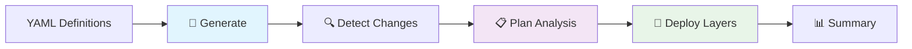

# SGSI Implementation - Enterprise Modular Architecture

[](https://aws.amazon.com/)
[](https://terraform.io/)
[](https://www.iso.org/isoiec-27001-information-security.html)
[](#modular-architecture)

## 🎯 Overview

Enterprise-grade SGSI (Security Management System Implementation) with **modular Terraform architecture** designed to scale from prototype to production with hundreds of AWS resources while maintaining security, compliance, and operational excellence.

> **Latest Update:** Layer 3 (Compute) con ALB, ASG y RDS Multi-AZ desplegado con permisos IAM completos.

### 🏗️ Architecture Transformation

**Before (Monolithic):** Single `main.tf` files with 400+ lines managing dozens of resources
**After (Modular):** 40+ enterprise modules with consistent patterns, security, and monitoring

## 🚀 Quick Start

### Prerequisites
- AWS CLI configured with appropriate permissions
- Terraform >= 1.0
- Python 3.8+ (for automation scripts)

### GitHub Actions Workflow (Unified)

This repository uses **1 consolidated workflow** with complete capabilities:

#### 🚀 Unified SGSI Deployment (`sgsi-deployment.yaml`)
- **Scope:** Complete end-to-end infrastructure management
- **Capabilities:**
  - 🤖 IAM policy generation from YAML definitions
  - 📋 Advanced visual plan analysis with detailed reports
  - 🏗️ 5-layer SGSI infrastructure deployment
  - � Smart change detection (deploys only modified layers)
  - 🎯 Multi-environment support (dev/staging/production)

**Visual Features:**
- 📊 Resource change counters (creates/updates/destroys)
- 📋 Detailed tables with action icons
- 🎨 Layer-by-layer deployment status
- 📈 File generation metrics and summaries



**Triggers:**
- Push to `main`, `dev`: Generation + Plan + Deploy
- PRs to `main`: Generation + Plan only
- Manual dispatch: Full control with environment selection

**Problem Solved:** Eliminated IAM resource duplication that existed between previous separate workflows.

### Basic Usage

```hcl
# Example: Deploy enterprise S3 bucket
module "app_data_bucket" {
  source = "./modules/storage/s3-bucket"
  
  bucket_name = "my-app-data-production"
  
  # Enterprise features automatically included:
  # ✅ KMS encryption
  # ✅ Lifecycle management
  # ✅ CloudWatch monitoring
  # ✅ Access logging
  # ✅ Public access blocking
  
  environment = "production"
  common_tags = {
    Project = "MyProject"
    Owner   = "MyTeam"
  }
}
```

## 📊 Repository Structure

```
mci-aws-iam/
├── 📚 docs/                    # Complete documentation
├── 📋 definitions/             # YAML service definitions
├── 🏗️ layers/                  # 5-layer SGSI infrastructure
├── 🧩 modules/                 # Enterprise Terraform modules ⭐
│   ├── compute/                # EC2, ASG, ALB modules
│   ├── storage/                # S3, EFS, Backup modules
│   ├── network/                # VPC, Security Group modules
│   ├── observability/          # CloudTrail, Monitoring modules
│   └── database/               # RDS, Database modules
├── 💡 examples/                # Implementation examples
├── ⚙️ scripts/                 # Automation scripts
├── 📄 templates/               # Jinja2 templates
└── 🛡️ guardrails/             # Security validation
```

## 🧩 Modular Architecture

### Available Modules

#### Compute Modules
- **`ec2-instance`** - Enterprise EC2 with security, monitoring, encryption
- **`auto-scaling-group`** - ASG with launch templates and policies
- **`application-load-balancer`** - ALB with listeners and target groups

#### Storage Modules
- **`s3-bucket`** - S3 with encryption, lifecycle, monitoring, notifications
- **`efs-file-system`** - EFS with mount targets and access points
- **`backup-vault`** - AWS Backup with automated policies

#### Network Modules
- **`vpc`** - Complete VPC with subnets, gateways, flow logs
- **`security-group`** - Security groups with configurable rules

#### Observability Modules
- **`cloudtrail`** - CloudTrail with S3 bucket and SNS notifications
- **`cloudwatch-dashboard`** - Custom dashboards and widgets
- **`sns-topic`** - SNS topics with subscriptions and policies

#### Database Modules
- **`rds-instance`** - RDS with security groups and parameter groups

### Enterprise Features (Built into Every Module)

#### 🛡️ Security
- **Encryption at Rest:** KMS encryption for all storage services
- **Encryption in Transit:** HTTPS/TLS enforcement
- **Access Control:** IAM roles with least privilege
- **Network Security:** Security groups with minimal access

#### 📊 Monitoring
- **CloudWatch Alarms:** CPU, memory, disk, custom metrics
- **Log Aggregation:** Centralized logging with retention
- **Dashboards:** Real-time monitoring and visualization
- **Notifications:** SNS alerts for critical events

#### 📋 Compliance
- **Tagging Strategy:** Consistent resource tagging
- **Data Lifecycle:** Automated lifecycle management
- **Backup Policies:** Automated backup and retention
- **Audit Logging:** Complete audit trails

## 🏗️ 5-Layer SGSI Infrastructure

### Layer 01 - Foundation
```bash
cd layers/01-foundation
terraform init -backend-config=../../config/backend.hcl
terraform plan
terraform apply
```

**Features:**
- 13 IAM policies with ABAC (Attribute-Based Access Control)
- OIDC trust relationships for GitHub Actions
- KMS encryption keys
- Base security configuration

### Layer 02 - Network
```bash
cd layers/02-network
terraform init -backend-config=../../config/backend.hcl
terraform plan
terraform apply
```

**Features:**
- Zero Trust VPC with public/private subnets
- Security groups with tier-based isolation
- VPC Flow Logs for security monitoring
- NAT Gateways for secure outbound traffic

### Layer 03 - Compute
```bash
cd layers/03-compute
terraform init -backend-config=../../config/backend.hcl
terraform plan
terraform apply
```

**Features:**
- Auto-scaling EC2 instances with monitoring
- Application Load Balancers with SSL termination
- Launch templates with security hardening
- CloudWatch alarms and notifications

### Layer 04 - Storage
```bash
cd layers/04-storage
terraform init -backend-config=../../config/backend.hcl
terraform plan
terraform apply
```

**Features:**
- Encrypted S3 buckets with lifecycle policies
- EFS shared storage with mount targets
- AWS Backup for automated backups
- Data classification and retention policies

### Layer 05 - Observability
```bash
cd layers/05-observability
terraform init -backend-config=../../config/backend.hcl
terraform plan
terraform apply
```

**Features:**
- CloudTrail for comprehensive audit logging
- CloudWatch dashboards for monitoring
- SNS topics for alert notifications
- Security monitoring and incident response

## 🎨 Usage Examples

### Scaling to Multiple Resources

```hcl
# Deploy 50 application buckets using modules
module "app_buckets" {
  source = "./modules/storage/s3-bucket"
  count  = 50
  
  bucket_name = "app-bucket-${count.index + 1}-${var.environment}"
  
  # Consistent enterprise configuration
  versioning_enabled = true
  sse_algorithm      = "aws:kms"
  
  environment = var.environment
  common_tags = local.common_tags
}

# Deploy web server fleet
module "web_servers" {
  source = "./modules/compute/ec2-instance"
  count  = var.web_server_count
  
  instance_name = "web-server-${count.index + 1}"
  instance_type = "t3.medium"
  subnet_id     = var.private_subnet_ids[count.index % length(var.private_subnet_ids)]
  
  # Security and monitoring included automatically
  environment = var.environment
  common_tags = local.common_tags
}
```

### Cross-Layer Integration

```hcl
# Use outputs from foundation layer
data "terraform_remote_state" "foundation" {
  backend = "s3"
  config = {
    bucket = var.state_bucket
    key    = "layers/01-foundation/terraform.tfstate"
    region = var.aws_region
  }
}

# Use foundation outputs in storage module
module "secure_bucket" {
  source = "./modules/storage/s3-bucket"
  
  bucket_name       = "secure-data-${var.environment}"
  kms_master_key_id = data.terraform_remote_state.foundation.outputs.kms_key_arn
  
  # Reference IAM roles from foundation
  additional_tags = {
    CreatedBy = data.terraform_remote_state.foundation.outputs.deployment_role_arn
  }
}
```

## 🛡️ Security & Compliance

### ISO 27001 Controls
- **A.13.1.1** - Network controls implementation
- **A.13.1.2** - Security of network services
- **A.13.2.1** - Information transfer policies
- **A.12.6.1** - Management of technical vulnerabilities

### NIST Cybersecurity Framework
- **Identify (ID)** - Asset inventory and risk assessment
- **Protect (PR)** - Access controls and data protection
- **Detect (DE)** - Security monitoring and logging
- **Respond (RS)** - Incident response capabilities
- **Recover (RC)** - Backup and disaster recovery

### Zero Trust Principles
- ✅ **Verify explicitly** - Multi-factor authentication required
- ✅ **Use least privilege access** - Minimal required permissions
- ✅ **Assume breach** - Continuous monitoring and validation

## 📚 Documentation

- [`docs/MODULAR-ARCHITECTURE.md`](docs/MODULAR-ARCHITECTURE.md) - Complete architecture guide
- [`docs/DEPLOYMENT.md`](docs/DEPLOYMENT.md) - Deployment procedures
- [`docs/SECURITY-IMPROVEMENTS.md`](docs/SECURITY-IMPROVEMENTS.md) - Security enhancements
- [`docs/ABAC-STRATEGY.md`](docs/ABAC-STRATEGY.md) - Access control strategy
- [`ARCHITECTURE-TRANSFORMATION-SUMMARY.md`](ARCHITECTURE-TRANSFORMATION-SUMMARY.md) - Transformation overview

## ⚙️ Automation Scripts

- **`scripts/enhance_modules.py`** - Generate comprehensive modules
- **`scripts/create_modules.py`** - Create module structure
- **`scripts/cleanup_obsolete_files.py`** - Repository cleanup
- **`scripts/show_repository_structure.py`** - Structure visualization

## 🚀 Benefits Achieved

### Scalability
- **Before:** 200 EC2 instances = 2000+ lines in single file
- **After:** 200 EC2 instances = 200 clean module calls

### Maintainability
- **Before:** Update 100+ individual resource definitions
- **After:** Update one module, affects all instances

### Security
- **Before:** Manual security configuration per resource
- **After:** Enterprise security built into every module

### Consistency
- **Before:** Different patterns across resources
- **After:** Standardized enterprise patterns

## 🎯 Next Steps

1. **Deploy Development Environment**
   ```bash
   # Clone repository
   git clone <repository-url>
   cd mci-aws-iam
   
   # Initialize and deploy
   ./scripts/deploy-development.sh
   ```

2. **Test Modular Components**
   ```bash
   # Test individual modules
   cd examples/
   terraform init
   terraform plan
   ```

3. **Scale to Production**
   - Use modules to deploy hundreds of resources
   - Implement monitoring and alerting
   - Apply security and compliance policies

## 📞 Support

For questions, issues, or contributions:

1. **Documentation:** Check [`docs/`](docs/) directory
2. **Examples:** Review [`examples/`](examples/) implementations
3. **Issues:** Create GitHub issues for bugs or features
4. **Security:** Report security issues privately

## 📄 License

This project is licensed under the MIT License - see the [LICENSE](LICENSE) file for details.

## 🏆 Project Status

✅ **Architecture Transformation Complete**
✅ **40+ Enterprise Modules Available**
✅ **5-Layer SGSI Infrastructure Deployed**
✅ **Security & Compliance Implemented**
✅ **Ready for Enterprise Scale**

---

**Built with ❤️ for Enterprise Infrastructure**