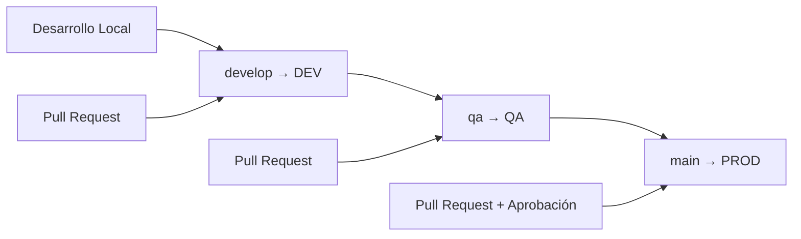

# 🚀 Guía de Despliegue

Esta guía explica cómo desplegar recursos IAM en los diferentes ambientes usando el repositorio.

## 🎯 Estrategia de Despliegue

### Flujo por Ambientes



### Mapeo Rama-Ambiente

| Rama Git | Ambiente AWS | Trigger | Aprobación |
|----------|--------------|---------|------------|
| `develop` | DEV | Push automático | No |
| `qa` | QA | Push automático | No |
| `main` | PROD | Push automático | Sí |

## 🏗️ Preparación del Entorno

### 1. Configuración de Secrets en GitHub

Navega a **Settings → Secrets and Variables → Actions** y configura:

#### Secrets Obligatorios
```bash
# Para cada ambiente (DEV, QA, PROD)
AWS_ACCESS_KEY_ID_DEV
AWS_SECRET_ACCESS_KEY_DEV
AWS_ROLE_ARN_DEV  # Opcional, si usas assume role

AWS_ACCESS_KEY_ID_QA
AWS_SECRET_ACCESS_KEY_QA
AWS_ROLE_ARN_QA

AWS_ACCESS_KEY_ID_PROD
AWS_SECRET_ACCESS_KEY_PROD
AWS_ROLE_ARN_PROD
```

#### Variables del Repositorio
```bash
# Regiones AWS
AWS_REGION_DEV=us-east-1
AWS_REGION_QA=us-east-1
AWS_REGION_PROD=us-east-1

# Buckets para estado de Terraform
TERRAFORM_STATE_BUCKET_DEV=mi-empresa-terraform-state-dev
TERRAFORM_STATE_BUCKET_QA=mi-empresa-terraform-state-qa
TERRAFORM_STATE_BUCKET_PROD=mi-empresa-terraform-state-prod
```

### 2. Preparación de Buckets S3

Crear buckets S3 para el estado de Terraform en cada cuenta:

```bash
# Ejemplo para DEV
aws s3 mb s3://mi-empresa-terraform-state-dev --region us-east-1

# Habilitar versionado
aws s3api put-bucket-versioning \
  --bucket mi-empresa-terraform-state-dev \
  --versioning-configuration Status=Enabled

# Habilitar cifrado
aws s3api put-bucket-encryption \
  --bucket mi-empresa-terraform-state-dev \
  --server-side-encryption-configuration '{
    "Rules": [{
      "ApplyServerSideEncryptionByDefault": {
        "SSEAlgorithm": "AES256"
      }
    }]
  }'
```

### 3. Configuración de Permisos IAM

#### Permisos Mínimos para GitHub Actions

```json
{
  "Version": "2012-10-17",
  "Statement": [
    {
      "Effect": "Allow",
      "Action": [
        "iam:CreateRole",
        "iam:DeleteRole",
        "iam:GetRole",
        "iam:ListRoles",
        "iam:UpdateRole",
        "iam:AttachRolePolicy",
        "iam:DetachRolePolicy",
        "iam:ListAttachedRolePolicies",
        "iam:CreatePolicy",
        "iam:DeletePolicy",
        "iam:GetPolicy",
        "iam:ListPolicies",
        "iam:CreatePolicyVersion",
        "iam:DeletePolicyVersion",
        "iam:ListPolicyVersions",
        "iam:PutRolePolicy",
        "iam:DeleteRolePolicy",
        "iam:GetRolePolicy",
        "iam:ListRolePolicies",
        "iam:TagRole",
        "iam:UntagRole",
        "iam:ListRoleTags"
      ],
      "Resource": "*"
    },
    {
      "Effect": "Allow",
      "Action": [
        "s3:GetObject",
        "s3:PutObject",
        "s3:DeleteObject",
        "s3:ListBucket"
      ],
      "Resource": [
        "arn:aws:s3:::mi-empresa-terraform-state-*",
        "arn:aws:s3:::mi-empresa-terraform-state-*/*"
      ]
    }
  ]
}
```

## 📦 Proceso de Despliegue

### 1. Desarrollo Local

#### Crear Nuevo Rol
```bash
# 1. Crear rama de feature
git checkout develop
git pull origin develop
git checkout -b feature/rol-lambda-api-pagos

# 2. Generar rol usando plantilla
python3 scripts/generate_role.py config.json \
  --gerencia aplicaciones \
  --area backend

# 3. Completar configuración
cd gerencias/aplicaciones/backend
cp terraform.tfvars.example terraform.tfvars
# Editar terraform.tfvars con valores específicos

# 4. Validar localmente
./scripts/validate.sh
```

#### Configuración de Variables

Ejemplo de `terraform.tfvars`:
```hcl
# Configuración del ambiente
ambiente     = "dev"
aws_region   = "us-east-1"
account_name = "dev-applications-account"

# Información del país y organización
pais = "GT"

# Información del responsable y proyecto
propietario      = "María García"
soporte_email    = "backend-team@empresa.com"
proyecto_codigo  = "PROJ-2024-PAYMENTS"
creado_por      = "maria.garcia@empresa.com"
ciclo_vida      = "Implementación"
version         = "1.0.0"
```

### 2. Despliegue a DEV

```bash
# 1. Commit y push a develop
git add .
git commit -m "feat(iam): agregar rol Lambda para API de pagos"
git push origin feature/rol-lambda-api-pagos

# 2. Crear Pull Request a develop
# 3. Revisar y hacer merge

# 4. El sistema automáticamente:
#    - Valida el código
#    - Ejecuta plan de Terraform
#    - Despliega a DEV
```

### 3. Promoción a QA

```bash
# 1. Crear Pull Request de develop a qa
git checkout qa
git pull origin qa
git checkout -b promote/dev-to-qa
git merge develop

# 2. Actualizar variables para QA si es necesario
cp terraform.tfvars qa.tfvars
# Editar qa.tfvars con valores específicos de QA

git add .
git commit -m "chore: promover cambios a QA"
git push origin promote/dev-to-qa

# 3. Crear Pull Request a qa
# 4. Revisar y hacer merge → despliega automáticamente a QA
```

### 4. Despliegue a PROD

```bash
# 1. Crear Pull Request de qa a main
git checkout main
git pull origin main
git checkout -b promote/qa-to-prod
git merge qa

# 2. Configurar variables de PROD
cp qa.tfvars prod.tfvars
# Editar prod.tfvars con valores específicos de PROD

# 3. Validaciones adicionales para PROD
./scripts/validate.sh
python3 scripts/validate_iam.py --tags-file prod-tags.json .

git add .
git commit -m "chore: promover cambios a PROD"
git push origin promote/qa-to-prod

# 4. Crear Pull Request a main
# 5. Solicitar aprobación del equipo de seguridad/arquitectura
# 6. Hacer merge → despliega automáticamente a PROD
```

## 🔍 Monitoreo del Despliegue

### 1. GitHub Actions

Monitorea el progreso en:
- **Actions tab** en GitHub
- **Environment deployments** 
- **Pull Request comments** (para plans)

### 2. Logs de Terraform

```bash
# Ver logs detallados en GitHub Actions
# Sección: "Deploy to [environment]"
```

### 3. Verificación en AWS Console

```bash
# Verificar que el rol fue creado
aws iam get-role --role-name rol-lambda-api-prod-pagos

# Verificar políticas adjuntas
aws iam list-attached-role-policies --role-name rol-lambda-api-prod-pagos

# Verificar tags
aws iam list-role-tags --role-name rol-lambda-api-prod-pagos
```

## 🚨 Manejo de Errores

### Errores Comunes

#### 1. Error de Backend de Terraform
```
Error: Failed to get existing workspaces: S3 bucket does not exist
```

**Solución**: Verificar que el bucket S3 existe y las credenciales son correctas.

#### 2. Error de Validación de Tags
```
Tags obligatorios faltantes: alcance_sox, propietario
```

**Solución**: Completar todos los tags obligatorios en el módulo.

#### 3. Error de Permisos IAM
```
AccessDenied: User is not authorized to perform: iam:CreateRole
```

**Solución**: Verificar que las credenciales AWS tienen los permisos necesarios.

### Rollback de Despliegues

#### Automático (Recomendado)
```bash
# 1. Revertir el commit problemático
git revert <commit-hash>
git push origin main  # O la rama correspondiente

# 2. El sistema automáticamente desplegará el rollback
```

#### Manual
```bash
# 1. Checkout a commit anterior conocido como bueno
git checkout <good-commit-hash>

# 2. Crear nueva rama y forzar despliegue
git checkout -b hotfix/rollback-deploy
git push origin hotfix/rollback-deploy

# 3. Crear Pull Request urgente con aprobación fast-track
```

## 🧹 Limpieza de Recursos

### Limpieza Automática

Usar el workflow de cleanup:

```bash
# 1. Ir a Actions → Cleanup Resources
# 2. Seleccionar:
#    - Environment: dev/qa
#    - Dry run: true (para revisar)
#    - Resource pattern: rol-.*-dev-.* (opcional)
# 3. Ejecutar y revisar resultados
# 4. Si está correcto, ejecutar con dry_run: false y force: true
```

### Limpieza Manual

```bash
# Listar roles para limpieza
aws iam list-roles --query 'Roles[?starts_with(RoleName, `rol-`) && contains(RoleName, `dev`)].RoleName'

# Eliminar rol específico (con cuidado!)
aws iam detach-role-policy --role-name <role-name> --policy-arn <policy-arn>
aws iam delete-role --role-name <role-name>
```

## 📊 Reportes y Auditoría

### Reportes Automáticos

Después de cada despliegue, el sistema genera:
- **Deployment Summary** en GitHub Actions
- **Infrastructure Inventory** 
- **Security Scan Results**

### Auditoría Manual

```bash
# Inventario de roles por ambiente
aws iam list-roles --query 'Roles[?starts_with(RoleName, `rol-`)].{RoleName:RoleName,CreateDate:CreateDate}' --output table

# Verificar compliance de tags
aws iam list-roles --query 'Roles[?starts_with(RoleName, `rol-`)].[RoleName,Tags]' --output json
```

## 🔔 Notificaciones

### Configurar Notificaciones (Opcional)

Para recibir notificaciones de despliegues, especialmente en PROD:

1. **Slack Integration**:
   - Configurar webhook en secrets: `SLACK_WEBHOOK_URL`
   - Modificar workflow para enviar notificaciones

2. **Email Notifications**:
   - Configurar SMTP settings
   - Agregar step de notificación en workflow

3. **Teams Integration**:
   - Similar a Slack con webhook específico

## 🔒 Consideraciones de Seguridad

### Para Despliegues a PROD

1. **Validación SOX obligatoria**
2. **Revisión de seguridad requerida**
3. **Aprobación de al menos 2 personas**
4. **Documentación de cambios críticos**
5. **Plan de rollback documentado**

### Mejores Prácticas

- **Nunca hacer push directo a main**
- **Siempre usar Pull Requests**
- **Probar primero en DEV y QA**
- **Validar localmente antes de commit**
- **Documentar cambios significativos**

Esta guía asegura despliegues consistentes, seguros y auditables en todos los ambientes.
