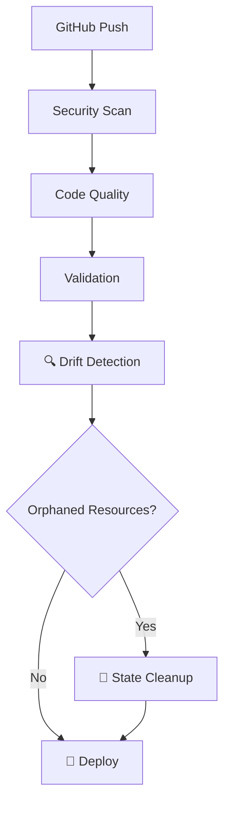
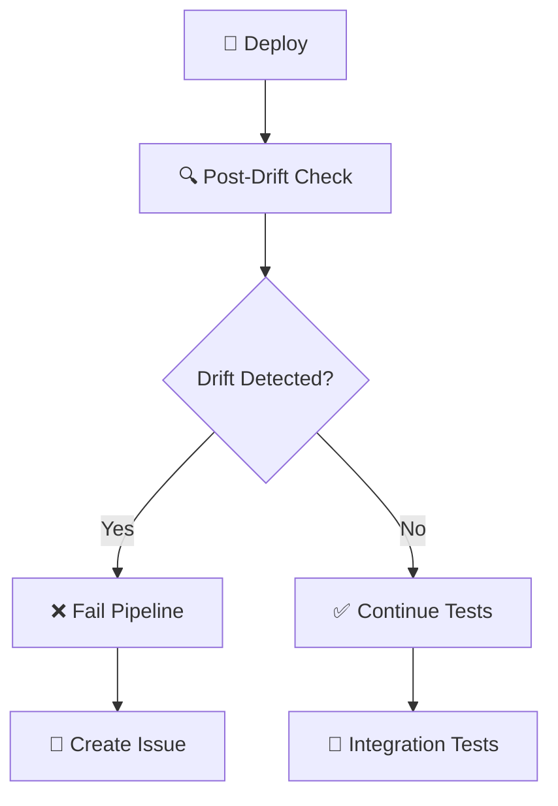

# Enterprise IAM Drift Detection & Reconciliation
# ================================================

## 🏗️ ARQUITECTURA EMPRESARIAL

### **Componentes del Sistema:**

1. **🔍 Drift Detection Engine** (`scripts/drift-detection.py`)
   - Escaneo automático de recursos fuente vs AWS
   - Detección de recursos huérfanos y faltantes
   - Generación de reportes ejecutivos
   - Scripts de limpieza automática

2. **🔄 Workflow Integration** (`.github/workflows/validate-and-deploy-clean.yml`)
   - **Pre-deployment**: Detección y limpieza de drift
   - **Post-deployment**: Verificación de consistencia
   - **Alertas automáticas**: Issues/notificaciones en caso de drift crítico

3. **📊 Monitoring & Reporting**
   - Reportes de drift con retención de 90 días
   - Métricas de consistencia de infraestructura
   - Auditoría completa de cambios

## 🚀 FLUJO OPERACIONAL EMPRESARIAL

### **Phase 1: Pre-Deployment Drift Detection**


### **Phase 2: Deployment & Verification**


## 📋 CASOS DE USO EMPRESARIALES

### **Caso 1: Rol Huérfano (Como `rol-oid-infra-rg-procesar`)**
1. ✅ **Detección**: Script identifica rol en AWS sin archivo fuente
2. ✅ **Clasificación**: Marca como "REMOVE_FROM_STATE_AND_AWS"
3. ✅ **Limpieza**: Ejecuta `terraform state rm` automáticamente
4. ✅ **Verificación**: Confirma eliminación post-deployment

### **Caso 2: Política Modificada Manualmente**
1. ✅ **Detección**: Script compara versiones de políticas
2. ✅ **Alerta**: Reporta drift de configuración
3. ✅ **Corrección**: Terraform restaura configuración desde código
4. ✅ **Auditoría**: Documenta cambio en reporte

### **Caso 3: Recurso Faltante en AWS**
1. ✅ **Detección**: Script identifica archivo sin recurso AWS
2. ✅ **Clasificación**: Marca como "DEPLOY_MISSING_RESOURCE"
3. ✅ **Deployment**: Terraform crea el recurso faltante
4. ✅ **Verificación**: Confirma creación exitosa

## 🎯 BENEFICIOS EMPRESARIALES

### **Operacional:**
- ✅ **Zero manual intervention**: Todo automatizado
- ✅ **Proactive cleanup**: Previene acumulación de recursos huérfanos
- ✅ **Audit trail**: Completa trazabilidad de cambios
- ✅ **Cost optimization**: Elimina recursos no utilizados

### **Seguridad:**
- ✅ **Compliance**: Infraestructura siempre coincide con código
- ✅ **Access control**: Solo recursos autorizados existen
- ✅ **Change management**: Todos los cambios versionados
- ✅ **Rollback capability**: Capacidad de revertir cambios

### **Escalabilidad:**
- ✅ **Multi-environment**: Funciona en dev/qa/prod
- ✅ **Multi-tenancy**: Soporta múltiples gerencias
- ✅ **Performance**: Procesamiento paralelo de recursos
- ✅ **Extensibility**: Fácil agregar nuevos tipos de recursos

## 📊 MÉTRICAS Y KPIs

### **Métricas de Drift:**
- Número de recursos huérfanos por deployment
- Tiempo promedio de detección de drift
- Porcentaje de limpieza automática exitosa
- Frequency de drift por gerencia/equipo

### **Métricas Operacionales:**
- Deployment success rate con drift detection
- Tiempo adicional de pipeline por drift checks
- Reducción de incidentes de seguridad
- Cost savings por recursos eliminados

## 🔧 CONFIGURACIÓN Y MANTENIMIENTO

### **Variables de Entorno Requeridas:**
```yaml
# GitHub Secrets
AWS_ROLE_ARN: arn:aws:iam::393209814297:role/github-actions-iam-deployment-role

# Workflow Variables
TF_VERSION: "1.6.0"
PYTHON_VERSION: "3.11"
```

### **Permisos AWS Requeridos:**
```json
{
  "iam:ListRoles",
  "iam:ListPolicies", 
  "iam:ListRoleTags",
  "iam:GetRole",
  "iam:GetPolicy",
  "iam:DeleteRole",
  "iam:DeletePolicy"
}
```

### **Alertas y Notificaciones:**
- 🚨 **Critical**: Drift no resuelto después de deployment
- ⚠️ **Warning**: Recursos huérfanos detectados
- ℹ️ **Info**: Limpieza automática exitosa
- 📊 **Report**: Reporte semanal de métricas de drift

## 🎯 ROADMAP DE IMPLEMENTACIÓN

### **Fase 1: Core Implementation** ✅
- [x] Drift detection engine
- [x] Workflow integration
- [x] Basic cleanup automation

### **Fase 2: Enhanced Monitoring** 🚧
- [ ] Slack/Teams notifications
- [ ] Dashboard de métricas
- [ ] Historical trend analysis

### **Fase 3: Advanced Features** 📋
- [ ] ML-based drift prediction
- [ ] Auto-remediation policies
- [ ] Cross-account drift detection

---

## 🚀 RESULTADO ESPERADO

Con esta implementación empresarial:

1. **El problema actual** (`rol-oid-infra-rg-procesar`) se resuelve automáticamente
2. **Problemas futuros** se previenen con detección proactiva
3. **Operaciones** se optimizan con automatización completa
4. **Compliance** se garantiza con auditoría continua

**Esta es una solución arquitectural empresarial completa, no solo un fix temporal.** 🎯